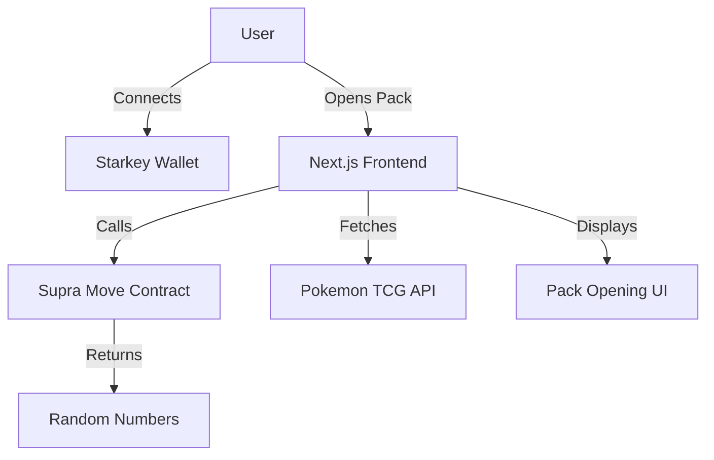

# PAKS.FUN — Pokemon TCG Booster Pack Opening Simulator

**Official Submission for Supra // Hackathon @ Permissionless IV**

---

## Live Demo

- Hosted: [https://paks.fun](https://paks.fun)
- [Video Demo](https://www.youtube.com/watch?v=Wba2EZ8vhZo)
- [Supra Testnet Deployment](https://testnet.suprascan.io/address/0x8cf400e6ba0ea4da54eac93df56ef8ae8c0e10c9dad49a0eb70006270fc4b5ec/f?tab=transactions&type=user%2Cblock_metadata%2Cautomated&pageNo=1&rows=10)


---

## Team Introduction

- **Name:** Markeljan
- **Role:** Solo Developer (Fullstack, Smart Contracts, UI/UX)
- **GitHub:** [https://github.com/markeljan](https://github.com/markeljan)
- **LinkedIn:** [https://linkedin.com/in/markeljan](https://linkedin.com/in/markeljan)

---

## Problem Statement & Solution

### Problem

Digital collectibles and TCGs (Trading Card Games) lack the thrill and transparency of real-world pack opening, especially when it comes to randomness and verifiability. Most web-based simulators use off-chain or opaque randomness, and wallet integration is often clunky or missing.

### Solution

**PAKS.FUN** delivers a web-based, visually rich Pokemon TCG booster pack opening experience, powered by:
- **Supra Move L1 contract** for on-chain randomness (seeded by timestamp, see [`contracts/sources/paksdotfunsupra.move`](contracts/sources/paksdotfunsupra.move))
- **Starkey Wallet** for seamless Supra-native wallet connection ([`lib/wallet.ts`](lib/wallet.ts))
- Modern, accessible UI/UX with real-time feedback and smooth animations

This ensures a transparent, fair, and fun digital pack opening experience, with all randomness and wallet actions verifiable on Supra's L1.

---

## Development Challenges

- **Supra Move Integration:** Adapting randomness logic to Move and ensuring correct resource management for each user.
- **Starkey Wallet:** Handling async wallet connection and user feedback for seamless onboarding.
- **UI/UX:** Achieving a tactile, responsive, and accessible interface that works across devices.
- **API Rate Limits:** Handling TCG API errors and missing keys gracefully.

---

## Project Overview

**PAKS.FUN** is a dApp that simulates opening a Pokemon TCG booster pack:
- Connects to Starkey Wallet (Supra-native)
- Calls a Supra Move contract to generate a random seed and derive 5 pseudo-random numbers (representing card pulls)
- Fetches and displays random cards from the Pokemon TCG API
- Animates the opening and card reveal process, with real-time feedback and error handling

---

## Design Diagram



---

## Technical Breakdown

### Technologies Used
- **Languages:** TypeScript, Move
- **Frontend:** Next.js 15, React 19, Tailwind CSS
- **Smart Contract:** Supra Move L1 ([`contracts/sources/paksdotfunsupra.move`](contracts/sources/paksdotfunsupra.move))
- **Wallet Integration:** Starkey Wallet ([`lib/wallet.ts`](lib/wallet.ts))
- **API:** [Pokemon TCG API](https://dev.pokemontcg.io/)

### Key Modules
- **`lib/wallet.ts`:** Handles Starkey Wallet connection, account retrieval, and transaction sending.
- **`contracts/sources/paksdotfunsupra.move`:** Move contract for on-chain randomness (seed generation and number derivation).
- **`app/page.tsx` & `components/`:** UI logic for pack opening, card flipping, and feedback.

### Supra Integration
- **Supra Move Contract:**
  - `generate_seed(account: &signer)`: Stores a new seed (timestamp-based) for the user.
  - `get_derived_numbers(addr: address)`: Returns 5 pseudo-random numbers for card selection.
- **Starkey Wallet:**
  - Connects user to Supra L1, enabling contract calls and transaction signing.

---

## Functional Demo & Usage

1. **Connect Wallet:** App auto-connects to Starkey Wallet on load (see status at top of page).
2. **Open Pack:** Click or drag the booster pack to open it (triggers randomness on Supra Move contract).
3. **Reveal Cards:** Click each card to flip and reveal. Card data is fetched using derived random numbers.
4. **Open Another Pack:** Click the button to repeat the process.

---

## Setup Instructions

### Prerequisites
- [Node.js](https://nodejs.org/) (v18+ recommended)
- [Bun](https://bun.sh/) (optional, for package management)
- [Pokemon TCG API key](https://dev.pokemontcg.io/)

### Installation

```bash
git clone https://github.com/yourusername/paksdotfun.git
cd paksdotfun
bun install # or npm install
cp .env.example .env
# Edit .env and set POKEMONTCG_API_KEY=your_api_key_here
```

### Running the App

```bash
bun run dev # or npm run dev
```
Visit [http://localhost:3000](http://localhost:3000)

---

## Open Source

All code and contracts are open source in this repository.

---

## License

MIT
